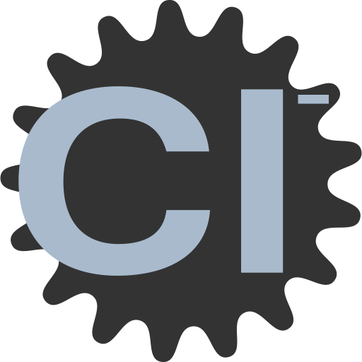

<!--
SPDX-FileCopyrightText: 2025 William Bell

SPDX-License-Identifier: GPL-3.0-or-later
-->

<div align="center">
<p>
    
</p>
<h1>Chloride</h1>
</div>

Chloride is the new C-based interpreter for the Argon programming language.  
It is designed as a drop-in replacement for the older Go implementation (argon-v3), while introducing a more efficient runtime and a cleaner, more consistent object model.

## Build

Currently, builds are only being made for linux x86_64 at [the projects Jenkins instance](https://jenkins.wbell.dev/job/chloride/). 

If this does not satify your requirements, feel free to build for your platform. the dependancies are `conan`, `flex`, `cmake` and `gcc`.

install using conan.
```
conan install . --build=missing
```

and finally build using conan.
```
conan build .
```

the final build can be found in `build/bin`.

## Overview

Chloride aims to remain as interchangeable with argon-v3 as possible.  
Most existing Argon code should run with minimal or no changes, and backwards compatibility is an ongoing priority.  
Where behaviour differs, the goal is for those differences to be predictable and well-defined rather than accidental quirks.

This interpreter replaces argon-v3's AST-walking runtime with a proper bytecode compiler, caching system, and virtual machine.  
The result is a more consistent execution model, lower memory usage, and improved overall performance, even though speed is not the sole focus of the project.

## Key Improvements Over argon-v3

- **Bytecode + VM architecture**  
  Chloride compiles source code into bytecode and executes it through a dedicated virtual machine.  
  The previous interpreter evaluated the AST directly at runtime, which limited performance and made optimisations difficult.

- **Reduced memory usage and CPU overhead**  
  Chloride is written in C with an emphasis on minimal allocations, predictable lifetimes, and efficient object handling.

- **Unified object model**  
  In contrast to argon-v3, where some values (such as numbers) were not objects, Chloride treats every value as a first-class object.  
  This simplifies the runtime and ensures a more consistent behaviour across all types.

- **Proper class and inheritance system**  
  Classes in Chloride are real objects, supporting inheritance and introspection in a clean, well-defined manner.  
  The old interpreter treated classes as a special-case construct, which restricted the language's expressiveness.

- **Backwards compatibility focus**  
  Chloride aims to match argon-v3’s behaviour closely enough that most existing Argon programs run unchanged.  
  Compatibility fixes and behavioural parity are treated as long-term goals.

## Project Goals

- Maintain high compatibility with argon-v3.  
- Minimise memory usage and improve runtime efficiency.  
- Provide a stable, maintainable interpreter core.  
- Keep the implementation straightforward so that future language features can be built cleanly on top of it.  
- Serve as the reference interpreter for Argon going forward.


## Project Status

Chloride is still under active development.
The object model is largely complete, but several core language features are missing or experimental. Basic control flow constructs such as for loops are not implemented yet, partly because the older syntax was confusing and may be replaced with something clearer. While backwards compatibility is a goal, perfect compatibility is unlikely, especially where new syntax or improved semantics resolve long-standing issues in argon-v3.

The interpreter currently contains known performance issues and occasional segmentation faults, and part of the development process is identifying and removing these. The intention is to stabilise the runtime, finalise the syntax, and avoid any further major redesigns. The hope is that Chloride becomes both the long-term Argon interpreter and the last large rewrite the language needs.

# Licence
GNU General Public License v3.0
