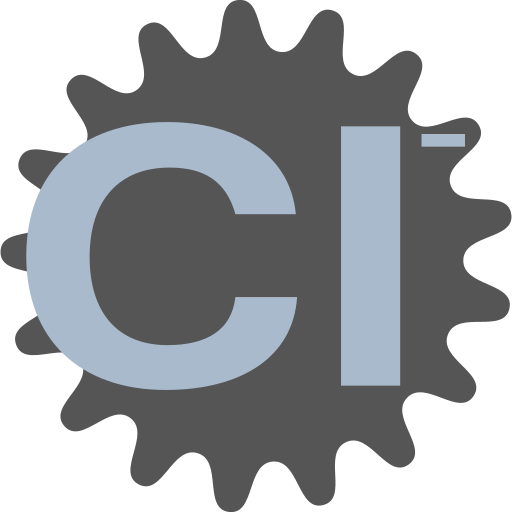

<!--
SPDX-FileCopyrightText: 2025 William Bell

SPDX-License-Identifier: GFDL-1.3-or-later
-->

    

<h1>Chloride</h1>

**Chloride** is a C-based interpreter for the Argon programming language. It is released as libre software - that is, software that **respects your freedom to run, study, modify, and share it**. All source code in this repository is libre, and the compiled binaries are fully freedom-respecting as well.

Chloride is designed as a **drop-in replacement** for the older Go implementation (`argon-v3`), providing a **more efficient runtime** and a **cleaner, more consistent object model**.

## Installation

Installation instructions can be found [here](installation.md).

## Overview

Chloride introduces a **bytecode compiler, caching system, and virtual machine**, replacing the older AST-walking runtime of argon-v3.

The result is a **more predictable execution model**, lower memory usage, and better performance, with a focus on **clarity and consistency** rather than strict backwards compatibility.

## Key Improvements Over argon-v3

- **Bytecode + VM architecture**  
  Chloride compiles source code into bytecode and executes it through a dedicated virtual machine.  
  The previous interpreter evaluated the AST directly at runtime, which limited performance and made optimisations difficult.

- **Reduced memory usage and CPU overhead**  
  Chloride is written in C with an emphasis on minimal allocations, predictable lifetimes, and efficient object handling.

- **Unified object model**  
  In contrast to argon-v3, where some values (such as numbers) were not objects, Chloride treats every value as a first-class object.  
  This simplifies the runtime and ensures a more consistent behaviour across all types.

- **Proper class and inheritance system**  
  Classes in Chloride are real objects, supporting inheritance and introspection in a clean, well-defined manner.  
  The old interpreter treated classes as a special-case construct, which restricted the language's expressiveness.

## Project Goals

- Minimise memory usage and improve runtime efficiency.  
- Provide a stable, maintainable interpreter core.  
- Keep the implementation straightforward so that future language features can be built cleanly on top of it.  
- Serve as the reference interpreter for Argon going forward.

## Project Status

Chloride is still **actively developed**. Its object model is mostly complete, but some core features are missing or experimental.

Chloride improves on argon-v3 with **cleaner syntax and more predictable semantics**, which may require adapting older code.

Known performance issues and occasional crashes remain, and development is focused on **stabilising the runtime, finalising the syntax, and eliminating major bugs**. The aim is for Chloride to serve as the **long-term Argon interpreter** and the **last major rewrite the language needs**.

## Licence
GNU General Public License v3.0
